# Laporan Proyek Machine Learning - Gregorius Adi Pradana

## Domain Proyek

Dalam era digital, transaksi kartu kredit telah menjadi salah satu metode pembayaran yang paling umum digunakan. Kemudahan, kecepatan, dan fleksibilitasnya menjadikan kartu kredit alat transaksi utama bagi banyak individu dan bisnis. Namun, peningkatan penggunaan kartu kredit juga membawa tantangan serius, yaitu risiko terjadinya fraud (penipuan). Fraud pada transaksi kartu kredit dapat berupa pencurian data kartu, penggunaan kartu tanpa izin, hingga penyalahgunaan oleh pihak yang tidak bertanggung jawab. Kerugian yang diakibatkan oleh tindakan ini sangat signifikan, baik bagi pengguna kartu kredit maupun lembaga keuangan.

Menurut laporan industri, kerugian global akibat fraud kartu kredit mencapai miliaran dolar setiap tahunnya. Selain kerugian finansial, kepercayaan pelanggan terhadap penyedia layanan keuangan juga dapat terpengaruh. Oleh karena itu, mendeteksi dan mencegah fraud dengan cepat dan akurat menjadi prioritas utama bagi penyedia layanan kartu kredit.

Tradisionalnya, deteksi fraud dilakukan menggunakan aturan berbasis logika (rule-based systems). Namun, pendekatan ini memiliki keterbatasan, seperti kesulitan menangani volume data yang besar, pola fraud yang dinamis, serta potensi tingginya false positive (transaksi yang sah tetapi terdeteksi sebagai fraud) dan false negative (transaksi fraud tetapi terdeteksi sebagai sah). Dalam konteks ini, machine learning muncul sebagai solusi yang lebih adaptif dan efektif.

Machine learning memungkinkan model untuk belajar dari data historis transaksi, baik yang valid maupun fraud. Dengan memanfaatkan algoritma seperti random forest, sistem deteksi fraud dapat mengenali pola-pola kompleks yang sulit dideteksi oleh metode konvensional. Model machine learning juga mampu terus diperbarui seiring bertambahnya data, sehingga lebih adaptif terhadap metode fraud yang baru.

Penerapan machine learning untuk deteksi fraud pada transaksi kartu kredit tidak hanya meningkatkan akurasi pendeteksian, tetapi juga membantu mengurangi waktu respons dalam mencegah kerugian yang lebih besar. Oleh karena itu, penelitian dan pengembangan di bidang ini menjadi sangat penting, baik untuk meningkatkan efisiensi sistem keuangan maupun melindungi konsumen dari risiko kejahatan siber.

Sebuah penelitian menggunakan Random Forest yang digabungkan dengan Synthetic Minority Oversampling Technique (SMOTE) berhasil mencapai skor F1 sekitar 98%. Metode ini dirancang untuk mengatasi tantangan data tidak seimbang dalam mendeteksi transaksi penipuan. Penelitian ini juga menunjukkan bahwa penyetelan hyperparameter dapat meningkatkan kinerja model secara signifikan [1].

Dalam penelitian yang membandingkan Random Forest dengan model neural networks untuk deteksi penipuan kartu kredit, Random Forest mencatat skor F1 makro sebesar 96%. Penelitian ini juga menyoroti keunggulan RF dalam hal interpretabilitas dan efisiensi komputasi dibandingkan model yang lebih kompleks [2].

Referensi :\
[1] [Credit Card Fraud Detection Using Enhanced Random Forest Classifier for Imbalanced Data](https://arxiv.org/abs/2303.06514)\
[2] [Analysis of Credit Card Fraud Detection Performance Using Random Forest Classifier & Neural Networks Model](https://everant.org/index.php/etj/article/download/1196/848/3334)

## Business Understanding

### Problem Statements
- **Keamanan Sistem Pembayaran :** Penipuan kartu kredit terus meningkat, merugikan institusi keuangan secara signifikan dan merusak integritas sistem pembayaran.
- **Keterbatasan Rule-Based System :** Metode deteksi penipuan berbasis aturan (rule-based system) memiliki keterbatasan dalam mengenali pola penipuan yang kompleks dan dinamis. Sistem ini sulit beradaptasi terhadap ancaman baru, membutuhkan pembaruan manual yang memakan waktu, dan sering kali menghasilkan banyak false positives maupun false negatives.
- **False Positives :** Tingginya transaksi valid yang salah ditandai sebagai penipuan dapat mengganggu pengalaman pelanggan dan menurunkan loyalitas mereka.
- **False Negatives :** Transaksi penipuan yang tidak terdeteksi (false negatives) dapat menyebabkan kerugian finansial yang besar dan mencederai reputasi bisnis karena ketidakmampuan sistem mendeteksi ancaman yang nyata.

### Goals
- **Keamanan Sistem Pembayaran :** Meminimalkan kerugian finansial akibat penipuan dengan deteksi yang lebih akurat dan cepat.
- **Mengatasi Keterbatasan Rule-Based System :** Menggunakan machine learning untuk mendeteksi pola penipuan yang lebih kompleks dan dinamis, serta meningkatkan efisiensi dan akurasi deteksi penipuan tanpa memerlukan pembaruan aturan secara manual.
- **Mengurangi False Positives :** Menurunkan jumlah transaksi valid yang salah ditandai sebagai penipuan untuk menjaga pengalaman pelanggan yang baik.
- **Mengurangi False Negatives :** Memastikan deteksi penipuan yang lebih akurat dengan meminimalkan jumlah transaksi penipuan yang lolos dari pengawasan, sehingga mengurangi kerugian dan melindungi reputasi bisnis.

### Solution statements
- Menggunakan random forest sebagai algoritma machine learning yang memiliki performa tinggi dan lebih robust dalam menangani data imbalance.
- Melakukan hyperparameter tuning pada model random forest untuk mendapatkan model yang lebih sesuai dengan data sehingga performa meningkat.
- Menggunakan SMOTE untuk oversampling data sehingga mengurangi data imbalance.
- Menggunakan ensemble learning dengan cara menggabungkan dua model random forest secara cascade untuk meningkatkan performa klasifikasi.

## Data Understanding
Dataset credit card transaction menyediakan catatan terperinci tentang transaksi kartu kredit, termasuk informasi tentang waktu transaksi, jumlah, dan detail pribadi serta pedagang terkait. Kumpulan data ini memiliki sekitar 1,3 juta baris.
[Kaggle](https://www.kaggle.com/datasets/priyamchoksi/credit-card-transactions-dataset)

### Variabel-variabel pada Credit Card Transaction Dataset adalah sebagai berikut:
-   **Unnamed: 0 :** indeks transaksi
-   **trans_date_trans_time	:** waktu dari transaction.
-   **cc_num :** nomor kartu kredit
-   **merchant :** toko tempat transaksi terjadi
-   **category :** tipe transaksi
-   **amt :** jumlah transaksi
-   **first :** nama depan dari pemegang kartu kredit
-   **last :** nama belakang dari pemegang kartu kredit
-   **gender :** gender dari pemegang kartu kredit
-   **street :** nama jalan dari pemegang kartu kredit
-   **city :** nama kota dari pemegang kartu kredit
-   **state :** nama negara bagian dari pemegang kartu kredit
-   **zip :** kode pos dari pemegang kartu kredit
-   **lat :** posisi garis lintang ketika transaksi
-   **long :** posisi garis bujur ketika transaksi
-   **city_pop :** populasi kota ketika transaksi terjadi
-   **job :** pekerjaan dari pemegang kartu kredit
-   **dob :** Tanggal lahir dari pemegang kartu kredit
-   **trans_num :** nomor unik transaksi
-   **unix_time :** waktu dalam format unix
-   **merch_lat :** posisi garis lintang dari toko
-   **merch_long :** posisi garis bujur dari toko
-   **is_fraud :** indikator apakah transaksi fraud (1) atau non-fraud (0)
-   **merch_zipcode :** kode pos dari toko

Berdasarkan exploratory data analysis didapatkan hasil sebagai berikut:

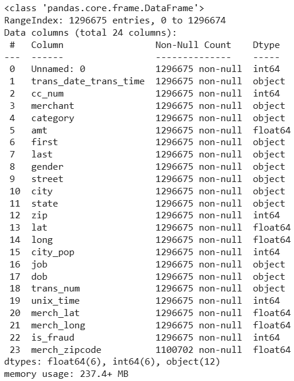
- Dataset memiliki 1296675 data dengan 24 atribut
- Dataset terdiri dari atribut numerik dan kategorikal

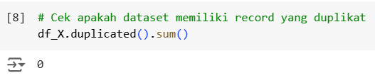
- Dataset tidak memiliki record yang duplikat
 
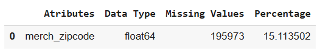
- Dataset memiliki missing value pada atribut **merch_zipcode** sebanyak sekitar 15%

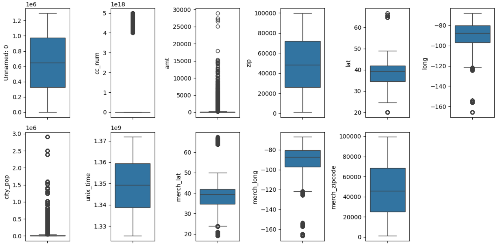
- Atribut numerik memiliki outlier tetapi pada atribut posisi, populasi, nomor kartu kredit, dan jumlah transaksi (bukan outlier).

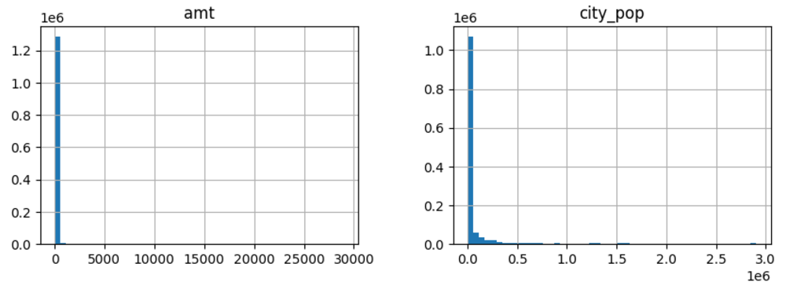
- Sebagian besar transaksi terjadi pada jumlah transaksi (**amt**) yang cenderung rendah dan pada kota dengan populasi (**city_pop**) rendah

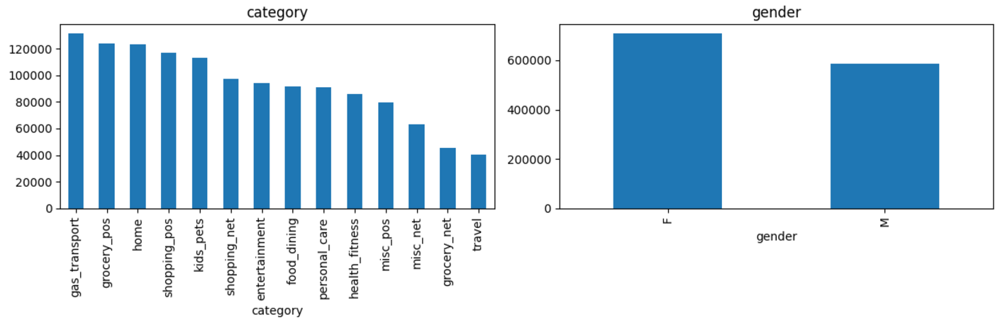
- Transaksi cenderung merata pada berbagai macam **category** dan **gender**

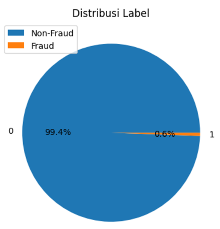
- Dataset sangat tidak seimbang, di mana label didominasi kategori non-fraud sebesar 99,4% dan fraud hanya 0,6%

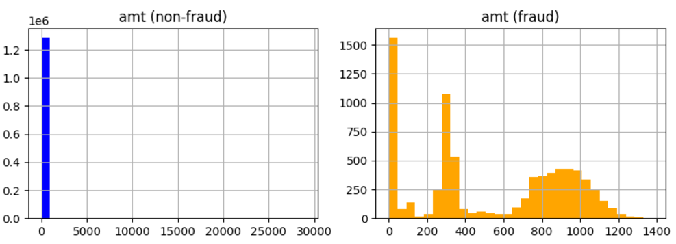
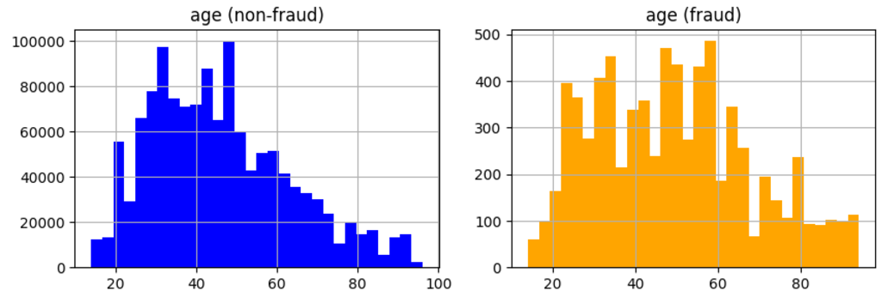

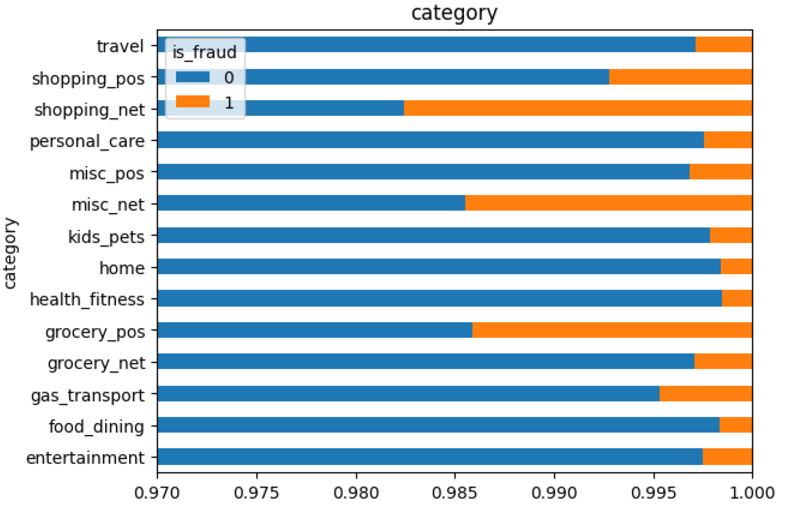
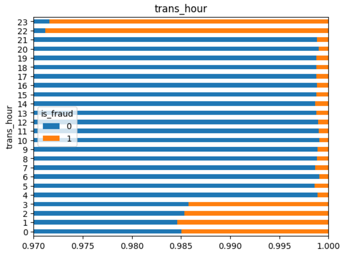
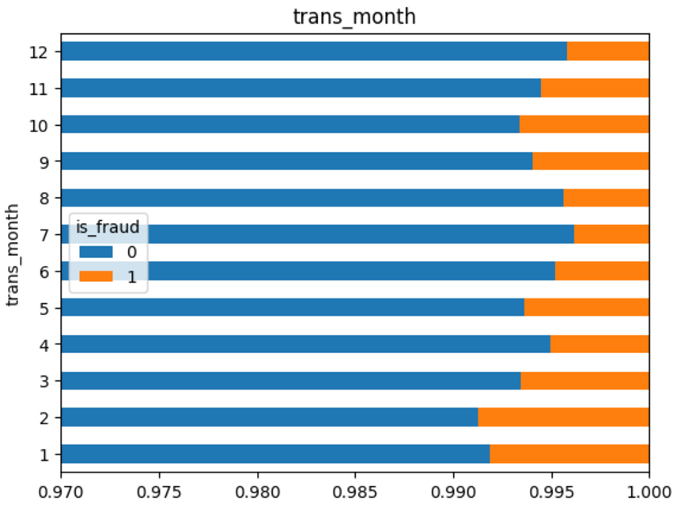
- Transaksi fraud cenderung terjadi pada jumlah pembelian (**amt**), umur pelaku (**age**), **category**, jam (**trans_hour**), dan bulan (**trans_month**) tertentu.

## Data Preparation

- **Split data train test :** agar performa model lebih valid maka model diuji pada data yang berbeda dari data training
- **Drop atribut :** beberapa atribut di drop dengan penjelasan sebagai berikut
    *   **Unnamed: 0 :** indeks transaksi tidak berhubungan dengan penipuan
    *   **cc_num :** terlalu unik
    *   **merchant :** terlalu banyak kategori
    *   **first :** nama dapan tidak berhubungan dengan penipuan
    *   **last :** nama belakang tidak berhubungan dengan penipuan
    *   **street :** terlalu banyak kategori
    *   **city :** terlalu banyak kategori
    *   **state :** terlalu banyak kategori
    *   **zip :** terlalu banyak kategori
    *   **lat :** tidak bisa digunakan secara langsung (posisi unik)
    *   **long :** tidak bisa digunakan secara langsung (posisi unik)
    *   **job :** terlalu banyak kategori
    *   **trans_num :** terlalu unik
    *   **unix_time :** sudah diwakili trans_date_trans_time
    *   **merch_lat :** tidak bisa digunakan secara langsung (posisi unik)
    *   **merch_long :** tidak bisa digunakan secara langsung (posisi unik)
    *   **merch_zipcode :** terlalu banyak kategori

- **Feature engineering :** untuk mendapatkan fitur-fitur yang lebih optimal maka disusun fitur baru seperti 
    * **trans_hour** : jam transaksi
    * **trans_day** : hari transaksi
    * **trans_month** : bulan transaksi
    * **age** : umur pengguna kartu kredit ketika transaksi

- **Split atribut :** memisahkan atribut numerik dan kategorikal karena membutuhkan penanganan yang berbeda
- **Normalisasi data :** data numerik dinormalisasi untuk menyamakan rentang nilai menjadi antara 0-1
- **Categorical encoding (one hot encoding) :** data kategori diubah menjadi numerik agar dapat dilakukan modelling
- **Combine atribut :** atribut numerik dan kategori digabungkan untuk membentuk satu kesatuan fitur
- **Handling imbalance (SMOTE) :** mengurangi data imbalance dengan oversampling

## Modeling
Model machine learning yang digunakan adalah random forest karena memiliki kemampuan yang lebih baik dalam mengatasi data imbalance. Tahapan dalam modelling yaitu
1. Mendefinisikan pipeline
2. Mengevaluasi model dengan beberapa parameter
3. Menguji model pada data testing
4. Membandingkan performa model random forest original, SMOTE, dan cascade

Model cascade dibangun dengan cara melatih model random forest kedua dengan data yang memiliki probabilitas prediksi rendah (prob<0.99) untuk kelas non-fraud (0). Prediksi akhir diperoleh dengan cara menggabungkan model random forest 1 dengan random forest 2 secara berurutan. Jika probabilitas prediksi kelas 0 pada model random forest 1 >= 0.99 maka secara otomatis data tersebut masuk kelas 0. Namun, jika prediksinya < 0.99 maka hasil prediksi diserahkan pada model random forest kedua. Model ini dibangun dengan SMOTE untuk kedua random forest.

- Metode SMOTE dapat meningkatkan performa khususnya F1-score tetapi akan menambah komputasi pada saat training.
- Algoritma random forest original lebih mudah untuk dilatih sedangkan algoritma cascade lebih kompleks.
- Algoritma cascade memiliki performa yang lebih baik tetapi dengan komputasi yang lebih besar karena terdiri dari dua model random forest.
- Algoritma random forest dicari parameter terbaiknya dengan hyperparameter tuning. Parameter yang dievaluasi yaitu n_estimator (100, 200) dan max_depth (None, 20).
- Model terbaik untuk random forest original yaitu n_estimator 200 dan max_depth None.
- Model terbaik untuk random forest SMOTE yaitu n_estimator 200 dan max_depth None.
- Model terbaik untuk random forest cascade yaitu n_estimator 200 dan max_depth None untuk kedua model.
- Model terbaik berdasarkan pengujian adalah model random forest cascade karena memiliki performa yang lebih tinggi terutama pada F1-score.

## Evaluation
Metrik evaluasi yang digunakan adalah akurasi, presisi, recall, dan f1-score. Seluruh metrik tersebut dapat dihitung dengan formula sebagai berikut.

Akurasi = (TP + TN / (TP + TN + FP + FN)\
Presisi = (TP) / (TP + FP)\
Recall = (TP) / (TP + FN)\
F1-score = (2 * Presisi * Recall) / (Presisi + Recall)\

Keterangan :\
TP = True Posutive\
TN = True Negative\
FP = False Positive\
FN = False Negative

Metrik akurasi merupakan seberapa banyak persetase data yang bisa diprediksi benar oleh model baik kelas fraud maupun non-fraud. Metrik presisi menjelaskan seberapa banyak persentase data yang benar diprediksi fraud dari seluruh data yang diprediksi fraud. Metrik recall menjelaskan seberapa banyak persentasi data yang diprediksi benar fraud dari seluruh data yang memang fraud. Metrik f1-score merupakan kombinasi keseimbangan dari presisi dan recall. Model terbaik tidak dapat diputuskan mengguanakan akurasi saja karena kelas data yang sangat tidak seimbang. Oleh karena itu, model terbaik diputuskan menggunakan metrik f1-score.

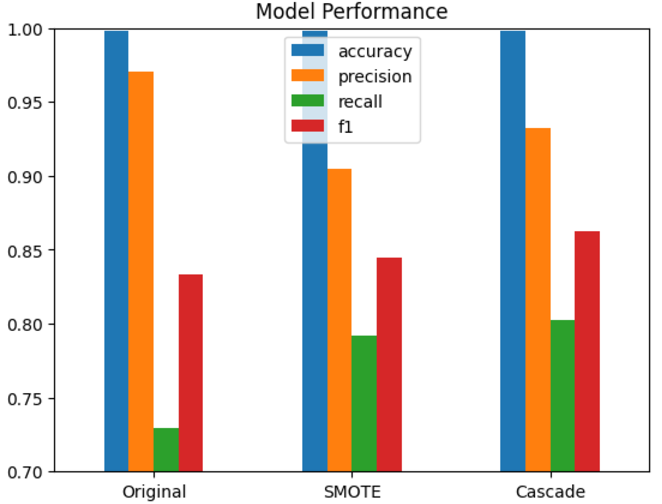
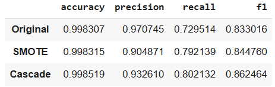

Berdasarkan pengujian yang telah dilakukan model random forest original memiliki akurasi 99,83%, presisi 97,07%, recall 72,95%, dan f1-score 83,30%. Kemudian, model random forest dengan SMOTE memiliki akurasi 99,83%, presisi 90,49%, recall 79,21%, dan f1-score 84,48%. Sementara itu, model cascade random forest memiliki akurasi 99,85%, presisi 93,26%, recall 80,21%, dan f1-score 86,25%. Hal ini berarti model cascade mampu melampaui model lainnya, khususnya pada f1-score. Peningkatan pada f1-score mencapai 2,95% dibandingkan model random forest original dan 1,77% dibandingkan model random forest dengan SMOTE. Peningkatan pada F1-score tersebut penting karena menawarkan keseimbangan tidak hanya pada pengurangan false positive tetapi juga false negative. Dengan demikian, model dapat menjaga pengalaman pengguna dan mengurangi kerugian dari segi bisnis.

